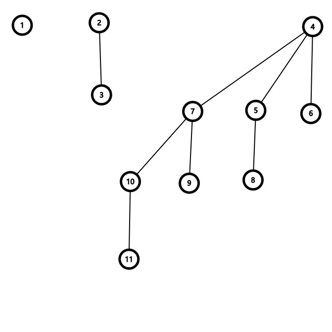

二项堆是一种有意思的数据结构。它通过维护一些大小为 $2^k$ 且便于合并的二项树来实现堆的合并。

## 二项树
二项树的定义如下：

- 一个单独节点是一棵二项树，记为 $B_0$。
- $B_i$ 由两棵 $B_{i - 1}$ 构成。其中一棵 $B_{i - 1}$ 的根节点是另一棵 $B_{i - 1}$ 的根节点的儿子。

下图展示了 $B_0$，$B_1$ 和 $B_3$。



这种结构具有一些非常优秀的性质。

1. $B_k$ 共有 $2^k$ 个节点，且树的高度为 $k + 1$。这可以通过归纳证明。
2. $B_k$ 中的第 $i$ 层共有 $\binom{k}{i - 1}$ 个节点。这也可以通过归纳证明。

同时，由于其定义，两个大小相等的二项树很容易合并：只需要将一棵树挂到另一棵上就可以了。

## 二项堆
一个二项堆包含很多个二项树，每棵二项树都满足堆的性质，即父亲大于或小于所有的儿子。

由于每棵二项树的大小都是 $2^k$，容易想到对堆的元素进行二进制分组。那么对这个堆进行合并的时候就相当于做了一次二进制加法，具体来说，我们在处理两个堆的 $B_i$ 的时候需要记录一个进位，表示 $B_{i - 1}$ 是否合并产生了 $B_i$。操作如下：

- 如果不存在进位，且两个堆均不存在 $B_i$，则合并后的堆中不存在 $B_i$。
- 如果存在进位或者两个堆中有一个 $B_i$，则新的堆中 $B_i$ 为这棵树。
- 如果存在两个 $B_i$ 或者有一个进位和一个 $B_i$，则需要进行合并。合并时比较两棵树的根节点的元素大小。如果要维护一个小根堆，那么将较大的挂在较小的根上。同时，将进位记作新的堆，合并后的堆中不存在 $B_i$。
- 如果所有的都存在，则合并两个并将合并后的 $B_i$ 设为剩下的那个。

这样就完成了合并的流程。时间复杂度 $O(\log n)$。

插入可以视作是新建了一个只有一个节点的堆，并将该节点和原堆进行合并。时间复杂度同样为 $O(\log n)$。

为了查找最小值，可以通过遍历所有的二项树，复杂度是 $O(\log n)$ 的。但是其实可以在每次修改的时候动态维护一个变量记录整个堆的最小值，那么每次查询的时候复杂度可以降到 $O(1)$。

如果要在堆中删除最小值，首先要找出最小值和它所在的位置。不难发现，最小值一定处在某一棵二项树的根节点处。因此可以按照如下步骤执行删除操作：

- 将这个最小值所在的二项树从堆中移除。（注意是在堆中取消记录这棵树，而不是直接将这棵树删除。）
- 将这棵二项树的根节点删除。这样，剩下的节点显然会构成一个二项树森林（至于为什么，可以画图理解）。同时，这个森林仍然满足二项堆的性质。因此可以将这个森林看作一个二项堆。
- 将这个二项堆和原始的二项堆合并。

复杂度为 $O(\log n)$。

如果要修改堆中的某个节点的数值，只需要直接修改，然后使用和普通的堆相同的调整方法将其调整为一个合法的堆即可。复杂度为 $O(\log n)$。

这样也就得到了删除任意一个节点的方式：将这个节点的权值修改为 $-\infty$，然后删除堆的最小值即可。

对于 [P3377 【模板】可并堆 1](https://www.luogu.com.cn/problem/P3377)，代码如下（写得比较一坨，仅供参考）：

```cpp
#include <cstring>
#include <iostream>
#include <map>
#include <numeric>
#include <vector>
using namespace std;
    using pii = pair<int, int>;
const int N = 1e5 + 10;
#define tr(x) ((int)((bool)(x)))
struct Heap {
    int tot;
    pii a[N];
    int res[N][30], siz[N];
    vector<int> sn[N];
    inline void Newheap(int fr, pii x) {
        res[fr][0] = ++tot;
        a[tot]     = x;
        siz[tot]   = 0;
    }
    inline void Merge(int x, int y) {
        int add = 0;
        for (int i = 0; i <= __lg(N); i++) {
            int &cx = res[x][i], &cy = res[y][i];
            int tmp = tr(cx) + tr(cy) + tr(add);
            if (tmp <= 1) cx = cx + cy + add, add = 0;
            else if (tmp == 2) {
                if (!cx) cx = add;
                if (!cy) cy = add;
                add = 0;
                if (a[cx] < a[cy]) sn[cx].push_back(cy), add = cx;
                else sn[cy].push_back(cx), add = cy;
                cx       = 0;
                siz[add] = i + 1;
            } else {
                int tx = add;
                add    = 0;
                if (a[cx] < a[cy]) sn[cx].push_back(cy), add = cx;
                else sn[cy].push_back(cx), add = cy;
                siz[add] = i + 1;
                cx       = tx;
            }
        }
        // for (int i = 0; i <= __lg(N); i++) cout << res[x][i] << " " << siz[res[x][i]] << endl;
        // cout << endl;
    }
    inline pair<pii, int> FindMin(int x) {
        pii tmin = {1e9, 0};
        int tres = 0;
        for (int i = 0; i <= __lg(N); i++) {
            if (!res[x][i]) continue;
            if (a[res[x][i]] < tmin) tmin = a[res[x][tres = i]];
        }
        return {tmin, tres};
    }
    inline void Delete(int x, int p) {
        int tmp = N - 1;
        memset(res[tmp], 0, sizeof(res[tmp]));
        for (auto x : sn[res[x][p]]) res[tmp][siz[x]] = x;
        res[x][p] = 0;
        Merge(x, tmp);
    }
} h;
struct DSU {
    int fa[N];
    DSU() {
        iota(fa, fa + N, 0);
    }
    inline int Find(int x) { return (x == fa[x]) ? x : (fa[x] = Find(fa[x])); }
    inline bool Merge(int u, int v) {
        int x = Find(u), y = Find(v);
        return (x != y) && (fa[y] = x);
    }
} dsu;
bool del[N];
int main() {
    ios::sync_with_stdio(0);
    cin.tie(0), cout.tie(0);
    int n, q;
    cin >> n >> q;
    for (int i = 1; i <= n; i++) {
        int x;
        cin >> x;
        h.Newheap(i, {x, i});
    }
    while (q--) {
        int op, x, y;
        cin >> op >> x;
        int fx = dsu.Find(x);
        if (op == 1) {
            cin >> y;
            if (del[x] || del[y]) continue;
            int fy = dsu.Find(y);
            if (fx == fy) continue;
            h.Merge(fx, fy);
            dsu.Merge(x, y);
        } else {
            if (del[x] == 1) {
                cout << -1 << endl;
                continue;
            }
            auto [tp, tc] = h.FindMin(fx);
            del[tp.second] = 1;
            cout << tp.first << endl;
            h.Delete(fx, tc);
        }
    }
}
```

其中，`Merge` 函数执行的是就地合并，是将堆 $X$ 和  $Y$ 合并到 $X$ 中。