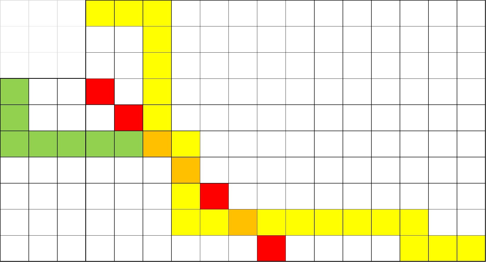

$$\def\s#1#2{\begin{bmatrix}#1\\#2\end{bmatrix}}$$
$$\def\S#1#2{\begin{Bmatrix}#1\\#2\end{Bmatrix}}$$
# 组合数
几个公式。
- 组合数列和
$$\sum_{i = r}^n \binom ir = \binom {n + 1}{r + 1}$$

考虑组合意义。

- 范德蒙德卷积
$$
\sum_{i = 0}^{k} \binom ai \binom b{k - i} = \binom {a + b}k
$$

清仓甩卖我杀了你。

- 范德蒙德卷积的对偶形式

$$ \sum_{k=0}^n \binom{k}{a} \binom{n-k}{b} = \binom{n+1}{a+b+1} $$

虽然不是上课讲的，但是想起来了就写一下吧，鬼知道明年会不会还有封印（seal）甩卖（sale）

- 卢卡斯定理
$$
\binom nm \equiv \binom {\lfloor n / p \rfloor}{\lfloor m / p \rfloor}\binom {n \bmod p}{m \bmod p} \pmod p
$$

妈妈生的。

# 容斥原理
算了吧，都整理到[这里](../2026-6-14-inversion)得了。

# 斯特林数

## 第一类斯特林数
将 $n$ 个球分成 $k$ 个不区分的轮换的方案数。

- 递推
$$ 
\def\s#1#2{\begin{bmatrix}#1\\#2\end{bmatrix}}
\s nk=\s {n - 1}{k - 1} + (n - 1)\s {n - 1}{k}
$$

考虑新的放在每一个后面都是一种情况。

- 小公式
$$
\def\s#1#2{\begin{bmatrix}#1\\#2\end{bmatrix}}
n! = \sum_{i=1}^n\s{n}{i}
$$

一个排列就是一堆轮换。

- 生成函数

对一行的生成函数：

$$
\def\s#1#2{\begin{bmatrix}#1\\#2\end{bmatrix}}
F_n(x) = \sum_{i = 0}^n\s{n}{i}x^i
$$

由递推式不难得出：

$$
F_n(x) = xF_{n - 1}(x) + (n - 1)F_{n - 1}(x)
$$

因此容易得到 $F_n(x) = x^{\bar n}$。

### [[FJOI2016] 建筑师](https://www.luogu.com.cn/problem/P4609)
首先把最大值找出来，他是前后缀最大值的交汇处。

考虑一个前缀最大值到下一个前缀最大值之前的位置，将这些位置归为一组，那么就总共有 $A + B - 2$ 组，因此原问题就相当于把排列分成若干组，每一组中找出最大值必须放在最前面，剩下的任意。在划分以后，组的顺序是固定的，也就相当于不考虑顺序，因此这个东西就相当于一个第一类斯特林数。又因为分出来的组里要选 $A - 1$ 个到前面来，所以就再乘一个组合数。

## 第二类斯特林数
分成集合，没有顺序的方案数。

第一次使用第二类斯特林数的时候我还不知道这是第二类斯特林数。

- 递推

$$
\def\S#1#2{\begin{Bmatrix}#1\\#2\end{Bmatrix}}
\S{n}{k} = \S{n - 1}{k - 1}+k\S{n - 1}{k}
$$
由于不关心顺序，放到 $k$ 个里面都是可以的。

- 通项公式

$$
\def\S#1#2{\begin{Bmatrix}#1\\#2\end{Bmatrix}}
\S{n}{k} = \sum_{i = 1}^m(-1)^i\binom nmi^n
$$

容斥。考虑钦定几个空的，二项式反演。

## 上升幂、普通幂和下降幂

一些恒等式。

- 上升幂转普通幂
$$
\def\s#1#2{\begin{bmatrix}#1\\#2\end{bmatrix}}
x^{\bar n} = \sum_{k=0}^n\s{n}{k}x^k
$$
就是生成函数。

- 普通幂转上升幂
$$
\def\S#1#2{\begin{Bmatrix}#1\\#2\end{Bmatrix}}
x^n = \sum_{k=0}^n\S{n}{k}(-1)^{n - k}x^{\bar k}
$$
斯特林反演。（虽然实际上是这个推出的斯特林反演，但是推导太困难了。）

- 普通幂转下降幂
$$
\def\S#1#2{\begin{Bmatrix}#1\\#2\end{Bmatrix}}
x^n = \sum_{k=0}^n\S{n}{k}x^{\underbar k}
$$
可以归纳证明。

> 引理：$x \times x^{\underbar k} = x^{\underbar{k + 1}} + k \times x^{\underbar k}$
>
> 直接代数推导容易证明。
>
> 把上面的式子左右两边乘以 $x$，凑一下形式就可以证明了。

当然，实际上也可以通过组合意义证明。左边就相当于是把 $x$ 个球放进 $n$ 个盒子里的方案数。右边就是先有顺序地选出几个盒子，然后把所有的球分进这些盒子里。

- 下降幂转普通幂
$$
\def\s#1#2{\begin{bmatrix}#1\\#2\end{bmatrix}}
x^{\underbar n} = \sum_{k=0}^n\s{n}{k}(-1)^{n - k}x^k
$$

还是斯特林反演。

### [[省选联考 2020 A 卷] 组合数问题](https://www.luogu.com.cn/problem/P6620)
啥阴啊。没有任何组合意义的给定多项式看上去没有什么优化空间，因此普通指数多项式肯定是白搭了。

考虑把多项式转化为下降幂多项式 $b$，那么推导一下式子，得到：

$$
\def\s#1#2{\begin{bmatrix}#1\\#2\end{bmatrix}}\def\S#1#2{\begin{Bmatrix}#1\\#2\end{Bmatrix}}
\begin{align}
\text{LHS}&=\sum_{k=0}^n\sum_{i=0}^mb_i \times k^{\underbar i} \times x^k \times \binom nk \\
&= \sum_{i=0}^mb_i \sum_{k = 0}^nk^{\underbar i} \times x^k \times \binom nk \\
&= \sum_{i=0}^mb_i \sum_{k = i}^nn^{\underbar i} \times x^k \times \binom {n-i}{k-i} \\
&= \sum_{i=0}^mb_i \times n^{\underbar i} \times x^i\sum_{k = i}^n x^{k-i}\binom {n-i}{k-i} \\
&= \sum_{i=0}^mb_i \times n^{\underbar i} \times x^i \times (1 + x)^{n - i}
\end{align}
$$

我靠这是怎么想到的。

一个小的注意就是下降幂这个玩意的定义就实际上对求和的下界做了调整。

### [Cards](https://www.luogu.com.cn/problem/CF1278F)
考虑推式子，设抽到的概率为 $p$，则大概就是要处理这样一个式子：

$$
\sum_{i=0}^ni^k\binom nip^i(1-p)^{n-i}
$$

考虑把 $i^k$ 转化成下降幂，得到：

$$
\def\s#1#2{\begin{bmatrix}#1\\#2\end{bmatrix}}\def\S#1#2{\begin{Bmatrix}#1\\#2\end{Bmatrix}}
\begin{align}
&\sum_{i=0}^n\binom nip^i(1-p)^{n-i}\sum_{j=0}^k\S{k}{j}i^{\underbar j}\\
=&\sum_{i=0}^n\binom nip^i(1-p)^{n-i}\sum_{j=i}^k\S{k}{j}j! \binom ij\\
=&\sum_{i=0}^n\sum_{j=i}^k j! \S kj p^i(1-p)^{n-i}\binom ni \binom ij \\
=&\sum_{j=0}^kj!\S kj \binom nj\sum_{i=j}^n \binom {n-j}{i-j}p^i(1-p)^{n-i} \\
=&\sum_{j=0}^kp^jj!\S kj \binom nj\sum_{i=0}^{n-j}\binom{n-j}ip^{i}(1-p)^{n-i-j} \\
=&\sum_{j=0}^kp^jj!\S kj \binom nj
\end{align}
$$

# 其他技巧
## Bell 数
整数划分的方案数。
$$
B_n = \sum_{k=0}^n\binom nk B_k
$$
## 卡特兰数
括号序列数。

$$
H_0=1,H_1=1
$$

# 经典问题
## 网格走路
### 限制一条主对角线
> 从 $(0, 0)$ 走到 $(n, m)$，只能向下或者向右，不能经过 $y=x-b$，求方案数。

考虑用全部减去不合法的。对于一条不合法的路径，找出他第一次经过直线的位置，把从起点到这个位置的路径沿直线对称，会发现恰好对应了所有的将起点对称过去以后的路径。

大概就是长这样，因此只需要两个组合数相减就行了。特别地，当 $b = 1$ 的时候这个东西就是卡特兰数。注意，这个有可能无解。

### 限制两条主对角线
> 不能经过 $y=x-b$ 和 $y=x+c$。

如果按照刚才的办法，把两个都减掉肯定会算重，那么考虑容斥。

也就是先按照 $l_1$ 对称，过去以后再按照 $l_2$ 对称，如此往复，可以得到最终答案，这个通常叫做反射容斥。

### 