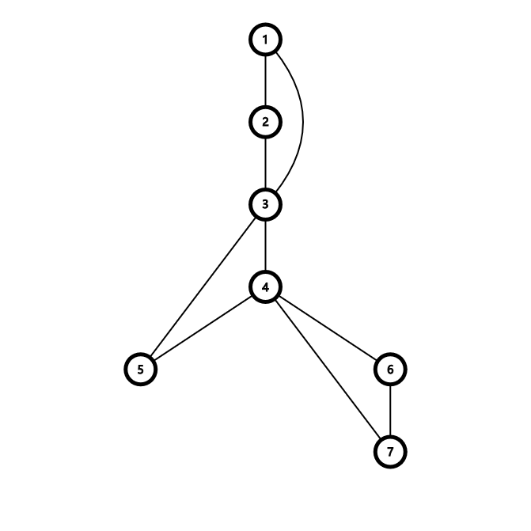

# 最优化
## [最短路径](https://qoj.ac/problem/8673)
有点意思。

首先考虑边点比不大的测试点。考虑双向跑 Dijkstra。但是问题在于，第一次相交的时候不一定是最短路，有可能这次相交走的最后一条边是非常大的，而两个集合的另一条相交的边非常小，这种情况下可能造成误判。

但是显然一条最短路最多只会有一条边不在最短路上，原因是考虑一个外面的节点，他到两端的距离一定大于交点到两端的距离，所以所有节点都一定至少是在一侧被搜到了。因此一个简单的想法就是枚举一侧的所有节点的所有出边，复杂度为 $O(\frac{Sn}m+S\log S)$，其中 $S$ 表示一侧搜到的节点数量。

考虑 $S$ 可能会有多大。分析一下可以发现在图完全随机的情况下，Dijkstra 每次从堆里弹出元素的过程，可以理解为是每次是一个随机变量！那么两次搜索就相当于是两边随机摸球，直到摸到一个相同的。期望是生日悖论提供的 $\sqrt n$，因此上面的复杂度在边点比较小的时候可以看作 $O(\sqrt n \log n)$，可以接受。

问题是当边点比变大的时候，上面这个东西就可能退化成 $O(n \sqrt n)$ 的（单次）。究其原因，是 $O(\frac{Sn}m)$ 的部分造成的。这一部分包含两个操作：边的松弛和枚举中间边。首先解决松弛的问题，考虑一个点能松弛的所有点中，一定是边权最小的边指向的点的边权先出队，因此可以在松弛的时候先只松弛最小的边，等他出来了再把下一个放进来。

然后解决枚举中间边的操作。考虑这条边的限制：有 $w \le 2(d_{s,x}-d_{s,a})$，其中 $a$ 是这条边在 $s$ 侧的点，在 $t$ 侧也是同理。考虑到 $\le d_{s, x}-d_{s, a}$ 的边实际上就是最短路树上的所有边，那么这俩感性理解一下应该差不多多的，那么就只松弛这些边就好了，这样复杂度就对了。

## [Classic Problem](https://qoj.ac/problem/6520)

首先对于两个关键点之前的一段区间显然应该顺着连，那么不妨将他们直接缩点。这样点数就比较能看了。

但是边数依然不大好看，因此 Kruskal 就未必合适了。考虑 Boruvka，一个点能到达的所有特殊边都是确定的，因此实际上就是找左右两边第一个不在同一连通块且没有特殊边的点。这个直接每次往左跳，全都跳一遍的复杂度是 $O(m)$ 的。

# 连通性
## [Slay the Spire](https://qoj.ac/problem/8824)
建图的话，要想吃满所有加分，必然要求每个点的入度和药水的数量加起来要大于等于出度（对于起点，额外认为这里有一个药水或者入度之类的），然后如果有一个点的入度小于出度，就必然要放弃一些边的边权，把边变成药水。这个操作只会改变起点的出度，对其他的都是没有影响的，因此这个操作显然每次删掉的都是边权最小的边。

然后这样一来还有个问题，那就是注意到图未必是强连通的，在不强连通的情况下好像不好一笔画，而缩点以后就变成了一个 DAG，注意到只有入度为 $0$ 的点才存在这个问题，只要这些点都能够到达，那么剩下的节点一定也能够到达，因此考虑跳到那些节点上，找那个 SCC 中最小的边即可。当然，同时可能会使得你拥有一个反悔的机会。（也就是说，由于你要求这个节点一定要连一个两端都在 SCC 内的边，原来的一条更小但是连在 SCC 外面的边就可以撤销掉了。）

## [Link Cut Digraph](https://qoj.ac/problem/2214)
相当于是动态维护强连通分量大小。如果顺着做的话好像没什么好的办法，于是考虑一些神秘做法。

分治。将左半边的所有边加进去，然后暴力缩点。这样的话这些边就被分成了两部分：一部分是 SCC 内的边，一部分是 SCC 之间的边。考虑 SCC 内的边在右半边加入边的时候没有用了，我们可以直接将 SCC 缩点。而左边一部分在统计答案的时候又完全没有用到这些不在 SCC 内的边（因为他们永远没法构成 SCC），这样就只需要把 SCC 内的扔进左边递归，SCC 外面的加上右半边扔到右边递归即可。注意 SCC 外面的不能算进分治算 $\operatorname{mid}$ 的区间长度中，不然复杂度就炸了。

## [Finance](https://qoj.ac/problem/15449)
考虑什么图一定是可行的。不难发现，两个人之间只要有两条边无交的路径都能到达，就肯定可以平账，那么一个边双连通分量内部就都是可以平账的。

然后把边双缩掉，现在的问题就是剩下的这棵树上的帐怎么平。然后如果一条边两边要平的帐大于他的容量，那么就炸了。剩下的都能平，容易构造。

## [Trajan 算法](https://qoj.ac/problem/14810)
讲了一遍，SDCPC2026 热身赛该不会还是不会，记忆力是鲤鱼还是金鱼？

这个东西是所有初学者理解 Tarjan 过不去的坎，因为这个实际上对应的是一种特殊情况，只有这种情况会造成误判。大概长这样：

在算 $5$ 号点的时候，会用 $3$ 号点更新，如果更新成了 $\operatorname{low}$，那么他的 $\operatorname{low}$ 就成了 $1$，显然不对。

还有别的情况吗？没了。于是只需要判断一个割点是否有两个点双连通分量都和他连了两条边就行了。具体实现的时候，lcn 场上想了个树上差分，但是没调出来，实际上好像直接枚举就行吧/yiw

## [「SWTR-8」地地铁铁](https://www.luogu.com.cn/problem/P8456)

考虑什么情况下会不合法。如果一个点双里面有黑白两色，那么直觉是肯定可行，但是并不是，有一个特例就是只有起终点两个是分割点。

然后考虑跨点双的情况。建一个广义圆方树，考虑如果路过的全都是同色的那么就可行，否则就不可行。那么直接维护一下就好了。

# 欧拉路径
## [Melody](https://codeforces.com/contest/2110/problem/E)
哇还有*2300。

不难发现这个限制就是 $a_i$ 和 $b_i$ 交替相等。那么直接建二分图，然后跑欧拉路径就可以了。

如果要求最小的话就再把边排序。

## [Binary Substrings](https://qoj.ac/problem/5434)
首先考虑这个玩意的上界。显然希望同一长度的串尽可能全都不相同，然后这样让小于某个临界值的串都有 $2^x$ 种，大于这个临界值的串都互不相同。这个临界值应该是最大的 $k$，满足 $2^k + k - 1 \le n$。

接下来考虑如何构造。构造一张有 $2^k$ 个节点的图，每个点代表一个二进制字符串，然后对 $c_1c_2c_3\dots c_k$ 向 $c_2c_3\cdots c_k1$ 和 $c_2c_3\cdots c_k0$ 连边，那么他的一个哈密顿回路就代表了一个长度为 $2^k + k - 1$ 的构造方案。同时，他的一个欧拉回路就代表了一个长为 $2^{k+1}+(k+1)-1$ 的构造方案。原因是可以把图中的每一个节点都看作是长度为 $k+1$ 的两个子串的公共部分，那么每个公共部分再加上后面的边就是一个子串，只要后面的边不一样，子串也就不一样。

然后哈密顿回路是 NP 的，但是欧拉回路是能求的，在 $n=2^k+k-1$ 时，建 $2^{k-1}$ 的图，跑一个欧拉路径就算是构造完了。原因是每个 $k$ 的子串都是不同的，那么以他们为前缀的每一个 $k + 1$ 也就是不同的了，同理所有的都是不同的。

但是当 $n$ 大一些的时候，不难发现在一个路径后面还需要补上一些东西。那么再建出来一张 $k$ 的图，删掉哈密顿回路，因为路径上的一个点再加上他的出边构成了一个 $k+1$ 的图。删掉以后，由于每个点都删掉了一个入度和出度，他还是欧拉图，并且实际上就是一堆环了，因为每个点的入度和出度都是 $1$。根据欧拉路径的说法，只需要再从当前的图上对每个连通块跑一个欧拉路径就可以了。

## [生命线](https://qoj.ac/problem/15880)
神奇的结论：在 $n \le 26$ 的时候，一种字符串实际上有本质相同的 $P^{n}_{26}$ 种串，所以当 $n=12$ 的时候这个数就已经比 $k$ 大了，这之后就相当于是求最小值了。其之前的做法是考虑 $O(\operatorname{Bell}(n))$ 地枚举所有的串，然后分别计算贡献。

当 $n$ 很大的时候，先思考如何计算最大生成树。显然应该是把 $sa_i \leftrightarrow sa_{i+1}$ 连起来，因此他的权值就是 $\sum height$。根据经典结论，这玩意等于 $\binom {n+1}2-C$，$C$ 为本质不同子串数量。

因此只需要找到本质不同字串数量最大的字符串即可。和上一个题是一样的，只需要改成 $26$ 进制版本即可。

# 2-SAT
## [喵了个喵 II](https://qoj.ac/problem/5689)
先思考如果是两个怎么做。要求是任意两个的相对顺序都一样。那么对于两个元素，分成三种情况：
- 无交：随便怎么选
- 交叉：规定顺序
- 包含：炸了

所以就是要求不能包含。

然后当他是 $4$ 个数的时候，先强制规定一个分配的方案，然后把他当成两对数来做就可以了。思考一下，有 $(1,2,1,2)$ 和 $(1, 1, 2, 2)$ 两种情况，其中包含的情况由于炸了不考虑。

然后就是要求他选了就不能选所有他包含的和包含他的元素。只需要考虑他包含的就行，那就是一个二维偏序状物，直接上主席树优化建图。