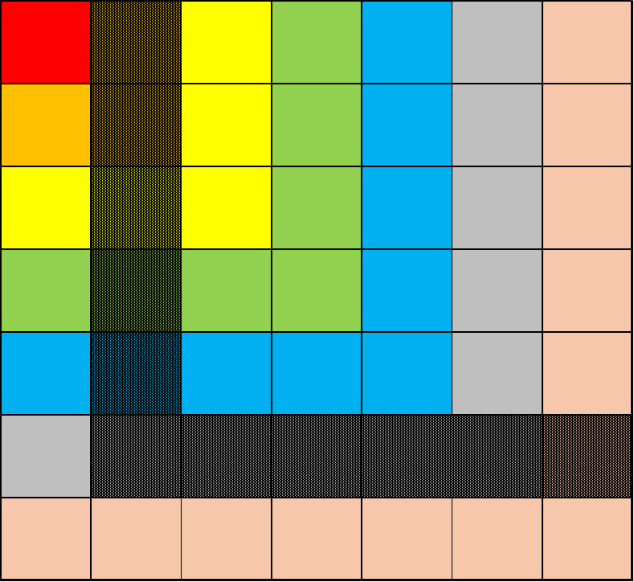

# T1
去掉所有不是 $k$ 的倍数的数，把剩下的都除以 $k$，我们就只需要考虑 $k=1$ 的情况了。

当不存在修改时，最优的方案是 $1$ 一组，剩下的两两分组。但是修改操作可以使得答案变大，首先考虑在可行的修改次数不足的时候，修改一定将不是 $k$ 的倍数或者没有用上（当有偶数个数的时候，最后一个会剩下）的 $k$ 的倍数的数改成 $k$。因此只需要统计有多少个可供修改的数，如果不够的话优先照顾这两种，如果还有富余就把大于 $1$ 的也改成 $1$ 即可。

```cpp
#include <iostream>
using namespace std;
int main() {
    int ttt;
    cin >> ttt;
    while (ttt--) {
        using ll = long long;
        ll n, m, k;
        cin >> n >> k >> m;
        ll cnt = n / k;
        if (!(cnt & 1)) cnt--;
        ll res = ((cnt + 1) >> 1);
        // cout << cnt << " " << res << " " << endl;
        if (m <= n - cnt) cout << m + res << endl;
        else {
            ll ans = n - cnt + res;
            m -= (n - cnt);
            ans += (m >> 1);
            cout << ans << endl;
        }
    }
}
```

# T2
考虑第 $i + 1$ 次操作和第 $i$ 次操作在前 $i - 1$ 步走过的路一定是相同的，只需要考虑第 $i$ 步。如果第 $i$ 步是 B 的话，第 $i$ 次跳完以后，第 $i + 1$ 次会跨过第 $i$ 次到达的终点，否则没有变化。然后我用了个 `set` 维护，我感觉应该随便怎么维护都行。

```cpp
#include <iostream>
#include <set>
using namespace std;
const int N = 1e5 + 10;
int main() {
    int ttt;
    cin >> ttt;
    while (ttt--) {
        int n, m;
        cin >> n >> m;
        string s;
        cin >> s;
        int nw = 1;
        set<int> loc;
        for (int i = 1; i <= m; i++) {
            int x;
            cin >> x;
            loc.insert(x);
        }
        for (int i = 1; i <= n; i++) {
            if (s[i - 1] == 'A') {
                nw++;
                loc.insert(nw);
            } else {
                auto it = loc.upper_bound(nw);
                nw++;
                while (it != loc.end() && *it == nw) nw++, it = next(it);
                // cout << i << " " << nw << endl;
                loc.insert(nw++);
                while (it != loc.end() && *it == nw) nw++, it = next(it);
            }
        }
        cout << loc.size() << endl;
        for (auto x : loc) cout << x << " ";
        cout << endl;
    }
}
```

# T3
看一眼数据范围显然要一个 $O(n \log n)$ 的操作。将目标数组排序，一个非常 naive 的想法是先把所有的提到最小，然后再提到第二小的，以此类推。但是你发现你炸了，因为要想把最小的扔下就需要把剩下的全都加一，那么复杂度直接就是 $O(n^2)$ 了。

考虑分治，在一个分治区间内，假定操作不会影响到其他区间，那么先将整个序列加到和左边最小值一致，然后给右半边每个都 $+1$，这样左右就分开了，递归解决右区间，再回过头来解决左区间即可。

```cpp
#include <iostream>
#include <vector>
#include <algorithm>
using namespace std;
const int N = 1010;
struct res {
    int x, id;
    bool operator<(res t) { return x < t.x; }
} b[N];
int a[N];
vector<string> ans;
inline void solve(int l, int r) {
    if (l == r) {
        if (a[b[l].id] != b[l].x) {
            for (; a[b[l].id] < b[l].x; a[b[l].id]++) ans.push_back("2 " + to_string(b[l].id));
        }
        return;
    }
    int mid = (l + r) >> 1;
    if (b[mid + 1].x != a[b[mid + 1].id]) {
        for (int i = mid + 1; i <= r; i++) {
            ans.push_back("2 " + to_string(b[i].id));
            a[b[i].id]++;
        }
    }
    for (; a[b[mid + 1].id] < b[mid + 1].x; ) {
        ans.push_back("1 " + to_string(a[b[mid + 1].id]));
        for (int i = mid + 1; i <= r; i++) a[b[i].id]++;
    }
    solve(mid + 1, r);
    solve(l, mid);
}
int main() {
    int n;
    cin >> n;
    for (int i = 1; i <= n; i++) cin >> b[i].x;
    for (int i = 1; i <= n; i++) b[i].id = i;
#ifdef DEBUG
    cout << n << endl;
    for (int i = 1; i <= n; i++) cout << b[i].x << " ";
    cout << endl;
#endif
    sort(b + 1, b + n + 1);
    solve(1, n);
    if (ans.size() > 20000) return 1;
    cout << ans.size() << endl;
    for (auto s : ans) cout << s << endl;
}
```

# T4
设 $f_i$ 表示以 $i$ 开头的最长的括号序列。

倒着转移，考虑什么情况下会产生贡献。显然只有 $s_i$ 是左括号的时候，才会有贡献，那么这种情况下，必然是将 $i + 1$ 开始的括号序列包起来才会有贡献，那么判断 $i + 1$ 开始的括号序列的右边是不是一个右括号，如果是，那么包起来，并且再拼上后面的一段。

```cpp
#include <iostream>
using namespace std;
const int N = 1e6 + 10;
int f[N];
int main() {
    string s;
    cin >> s;
    int n = s.size();
    f[n] = 0;
    s += "(((((((";
    for (int i = n - 1; i >= 0; i--) {
        if (s[i] == ')') continue;
        else if (s[i + f[i + 1] + 1] == ')') f[i] = f[i + 1] + 2 + f[i + f[i + 1] + 2];
    }
    int ans = 0, cnt = 0;
    for (int i = 0; i < n; i++) ans = max(ans, f[i]);
    for (int i = 0; i < n; i++) if (f[i] == ans) cnt++;
    if (!ans) cnt = 1;
    cout << ans << " " << cnt << endl;
}
```

# T5
有一定的贪心的想法。如果正常做的话，肯定是得记两维的 DP，记录当前节点和剩余的海狸。

但是这样显然炸了，考虑对一棵树一定是要么根节点还有剩余，但是他的儿子已经全都空了，要么就是根节点自己空了。那么 dfs 到当前节点的时候，对所有的儿子的贡献进行排序，如果不够都去一趟就尽可能走大的，并尽可能榨干当前节点的海狸，如果把所有的儿子全都榨干了还有剩余，那么就要求机器在当前节点和它的子节点之间来回蹦迪，知道达到前面说的两种情况之一即可。

这个题我自己没写代码，可以看看题解的。

# T6
翻译一下题目要求，第一个限制是明了的，后面两个分别限制了在两个方向的各个大 L 形的位置上应该各有一个。那么大概画一下图，会发现一件非常吊诡的事：只有题目中的那张图中黑色部分的上方，才是合法的放置位置！原因的话考虑下面的图：



阴影部分要求恰好有一个，而橙色部分也要求恰好有一个，那么就只能是两个的公共部分有一个。那么就相当于是在这个上面的三角形区域内，每列恰好放一个，满足行的数量和的方案数。考虑从下往上弄，因为下面合法的上面依然合法，不会出现上面选完了下面没法选的情况。那么扫一遍，答案就是几个组合数乘起来。

```cpp
#include <iostream>
using namespace std;
const int N = 2e5 + 10, MD = 998'244'353;
using ll = long long;
ll jc[N], ny[N];
inline ll fast(ll n, ll p) {
    ll ans = 1;
    while (p > 0) {
        if (p & 1) ans = ans * n % MD;
        n = n * n % MD, p >>= 1;
    }
    return ans;
}
inline void Init() {
    jc[0] = 1;
    for (int i = 1; i < N; i++) jc[i] = jc[i - 1] * i % MD;
    ny[N - 1] = fast(jc[N - 1], MD - 2);
    for (int i = N - 2; i >= 0; i--) ny[i] = ny[i + 1] * (i + 1) % MD;
}
inline ll C(int n, int m) {
    if (n < m) return 0;
    return jc[n] * ny[m] % MD * ny[n - m] % MD;
}
ll a[N];
int main() {
    Init();
    int ttt;
    cin >> ttt;
    while (ttt--) {
        int n;
        ll tot = 0;
        cin >> n;
        for (int i = 1; i <= n; i++) {
            cin >> a[i];
            tot += a[i];
        }
        int nw = 1 + !(n & 1);
        ll ans = 1;
        if (tot != n) goto No;
        for (int i = 1; i <= n; i++) {
            if (a[i] > max(0, n - (i - 1) * 2)) goto No;
        }
        for (int i = (n + 1) >> 1; i > 0; i--) {
            // cout << i << " " << nw << " " << a[i] << endl;
            ans = ans * C(nw, a[i]) % MD;
            nw -= a[i];
            nw += 2;
        }
        if (false) {
        No:
            cout << "0" << endl;
            continue;
        }
        cout << ans << endl;
    }
}
```
# T7
其实好像这个算是偏题，但是感觉有一定的启发意义就弄过来了。其实也有说法，有些时候题目会放一些数据随机的部分分，而且可能还不少，省选就放过好几档。

一般认为这个形式和 FFT 没有关系。首先当 $b$ 中 $1$ 很少的时候是好做的，因此猜测可能和根号分治有关系，那么思考能不能弄一个在 $1$ 很多的时候可行的做法。考虑由于 $a, b$ 是随机生成的，那么把 $a$ 和 $b$ 的对应关系拍到值域上，会发现 $b$ 的分布应该是均匀的（详见数学必修二 统计：估计德军坦克总数），那么直接在值域上从大到小地扫，期望应该不超过 $O(\frac nt)$ 次就能找到一个 $b=1$ 的位置，其中 $t$ 是 $1$ 的个数。

```cpp
#include <iostream>
#include <vector>
#include <set>
using namespace std;
const int N = 1e5 + 10;
long long x;
int n, d, a[N], b[N];
    long long getNextX(){
    	x=(x*37+10007)%1000000007;
    	return x;
    }
    void initAB(){
    	for(int i=0;i<n;i++) a[i]=i+1;
    	for(int i=0;i<n;i++) swap(a[i],a[getNextX()%(i+1)]);
    	for(int i=0;i<n;i++)
    		if(i<d) b[i]=1;
    		else b[i]=0;
    	for(int i=0;i<n;i++) swap(b[i],b[getNextX()%(i+1)]);
    }

int main() {
	cin >> n >> d >> x;
	initAB();
	vector<int> p;
	set<pair<int, int>, greater<>> s;
	for (int i = 1; i <= n; i++) {
		if (b[i - 1]) p.push_back(i);
		s.insert({a[i - 1], i});
		if (1ll * d * d <= n) {
			int ans = 0;
			for (auto x : p) ans = max(ans, a[i - x]);
			cout << ans << endl;
		} else {
			if (p.empty()) cout << 0 << endl;
			for (auto [ti, x] : s) if (b[i - x]) {
				cout << ti << endl;
				break;
			}
		}
	}
}
```

# T8
在没有删除的情况下，考虑什么时候会最大。一个结论是，所有路径必然相交。否则，将两个路径中的某两个端点交换，可以使得他们相交，并使得路径长度增加。

而当全部相交的时候，另一个结论是，所有路径必然交于重心。证明的话考虑如果存在一个子树的大小大于一半，根据鸽巢原理没法让每个里面的点都连向外面。至此就解决了不删除的情况。

当删除的时候，还有一个结论是，奇数个点的树在删除以后重心不变（显然你不会删除重心）。原因应该是比较显然的，因为在奇数个点的时候，不存在恰好卡到一半的子树，那么删掉一个点以后，最差也就是恰好有一个卡满一半。

因此不需要考虑重心发生的改变，只需要考虑该删什么就可以了。枚举每一条边，计算删边对距离的影响。删一次会让其子树的每个点的深度都减一，那么影响的其实就是子树大小，因此枚举一下就可以了。最后就是构造一组方案，一个简单的方法是跑一遍 dfs，开一个全局变量 $c$ 对 $\frac{n-1}{2}$ 取模，到一个节点就将这个节点的点权赋值为 $c$ 并将 $c$ 加一。正确性容易证明。

```cpp
#include <iostream>
#include <vector>
using namespace std;
const int N = 2e5 + 10;
vector<int> e[N];
int siz[N], ans[N], fa[N], dep[N], n, nw;
inline int get_siz(int u, int fa) {
    siz[u]  = 1;
    ::fa[u] = fa;
    dep[u]  = dep[fa] + 1;
    for (auto v : e[u]) {
        if (v == fa) continue;
        siz[u] += get_siz(v, u);
    }
    return siz[u];
}
inline int get_rt(int u, int fa) {
    for (auto v : e[u]) {
        if (v == fa) continue;
        if (siz[v] * 2 > siz[1]) return get_rt(v, u);
    }
    return u;
}
#define MD (n >> 1)
inline void get_ans(int u, int fa, int sk) {
    if (u != sk) ans[u] = (nw++) % MD + 1;
    for (auto v : e[u]) {
        if (v == fa) continue;
        get_ans(v, u, sk);
    }
}
int eg[N][2];
inline int mdf(int i) { return siz[i] - (i > fa[i]) + dep[max(i, fa[i])]; }
int main() {
    int ttt;
    cin >> ttt;
    while (ttt--) {
        cin >> n;
        for (int i = 1; i < n; i++) {
            int u, v;
            cin >> u >> v;
            e[u].push_back(v);
            e[v].push_back(u);
        }
        get_siz(1, 0);
        int rt = get_rt(1, 0);
        get_siz(rt, 0);
        int tot = 0, ans = 0;
        for (int i = 1; i <= n; i++) {
            if (i == rt) continue;
            if (!ans) ans = i;
            if (mdf(i) < mdf(ans)) ans = i;
        }
        get_ans(rt, 0, max(ans, fa[ans]));
        cout << ans << " " << fa[ans] << endl;
        for (int i = 1; i <= n; i++) cout << ::ans[i] << " ";
        cout << endl;
        for (int i = 1; i <= n; i++) {
            ::ans[i] = 0;
            e[i].clear();
        }
    }
}
```
