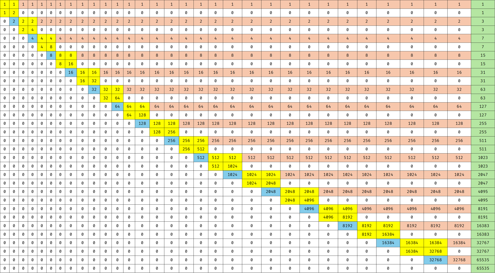
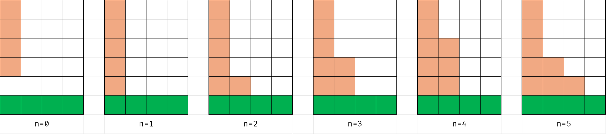
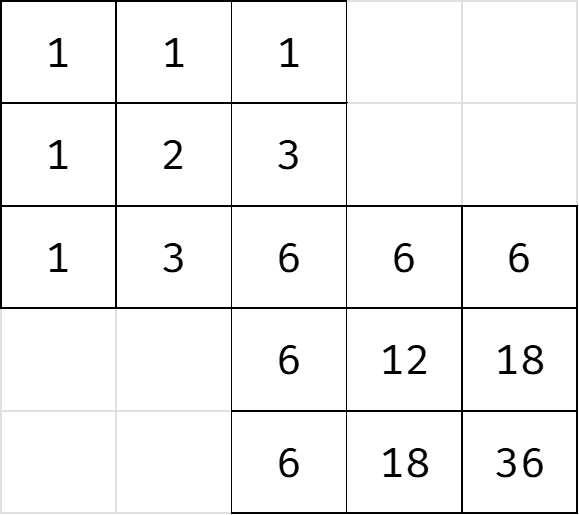
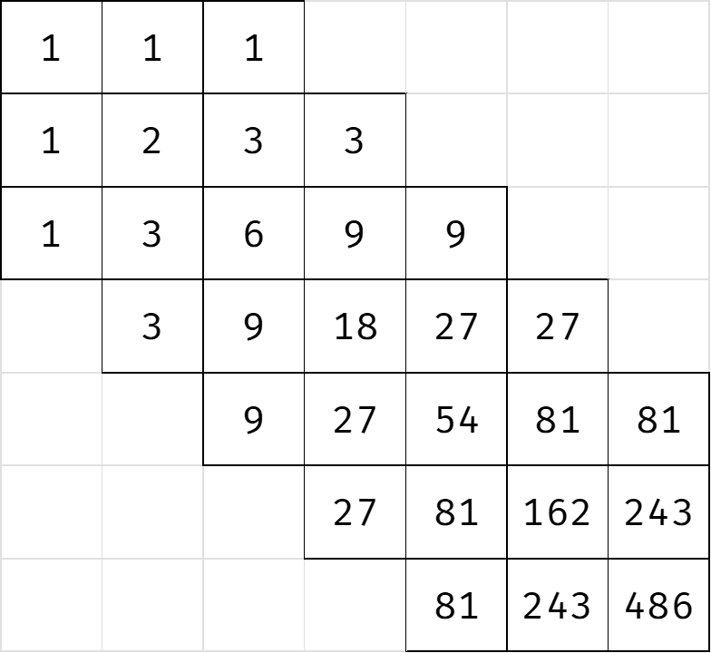
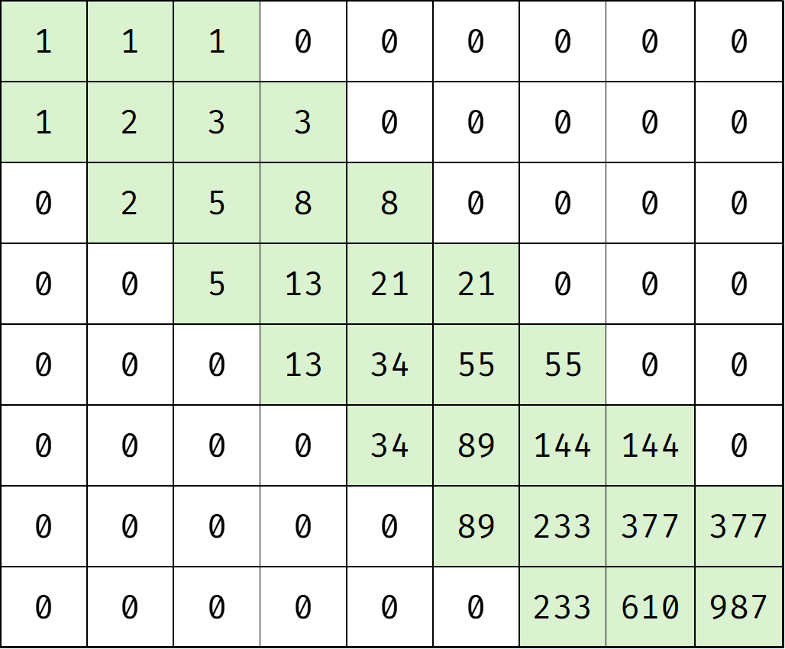

在讲这节课的时候，没有人意识到问题的严重性，直到……排列游戏。

# 构造
## [[CCPC 2024 重庆站] 合成大西瓜](https://www.luogu.com.cn/problem/P13572)

要求线性构造。

考虑树。不难发现，如果存在一个非叶子的最大值，那么一定可以取到最大值。理由是可以把这棵树通过随便怎么操作的方式变成一个菊花。（一个子树最多也就被合并成大小为 $2$ 的子树，所以肯定是可行的。）

然后就是如果不存在非叶子的最大值，要想取到最大值要求至少有两个最大值。考虑如何构造这个。把连接这两个节点的链拎出来，中间一段挂着的每棵子树都可以被缩到大小最多为 $1$ 的子树，然后再缩一下就能让整个链只剩两头了。

既然树是充分的，那么图就可以直接拉个生成树做。

## [P13570 [CCPC 2024 重庆站] 连方](https://www.luogu.com.cn/problem/P13570)
哇还有被降智环节。

这个当时 VP 过，全队就剩我一个人，拼尽全力发现自己想麻烦了，最后被 Argvchs 点破迷津，发现自己是弱智。

考虑无解的情况。如果最上面是满的黑色，最下面却不是，那么不管怎么连，上面那个矩形都是铺满的，而下面做不到。但是如果上下都满了，那么涂个大黑蛋就可以，直接判掉。

剩下的就是构造了。首先你得让上下两行行内的块都连通对吧，所以第二行和第六行就放第一行和第七行的补，这样横向就连通了，只需要纵向连通即可。

这个看起来很简单，只需要在第三行和第五行分别贴着一个角放一块，然后在第四行连起来就行了。

## [Inverse Counting Path](https://codeforces.com/problemset/gymProblem/104337/E)

首先这个肯定是 $\log V$ 级别的构造。那就先尝试一下二进制分解，不难发现要想得到 $2$ 种方案，需要一个正方形，而只要把正方形从左上到右下的排起来，就能够获得 $2$ 的幂次。然后得到了下面的构造。这个图比官方题解的明白一些。

每个蓝色位置就是一个 $2$ 的幂次，只需要控制这个蓝块右侧的红色导线是否存在，就可以得到任意的二进制分解。

但是这个构造比较乏力的一点就是他的无效位置比较多，导致这个大概需要 $n=60$，显然是过不去的。这个图上最没用的块好像就是蓝色部分，他们根本没有贡献路径方案，只单纯传导了幂次，比较浪费。

如果要想更加优秀，正方形的结构好像就太小了，没有操作空间。如果把方格变成 $3 \times 3$ 的，尝试操作的话，就会发现在这种情况下，可以构造没有蓝色方块，使用方形重叠的方式来传递幂次。

唯一的问题是，这种情况下变成了六进制，不能仅仅通过导线的有无来确定是否要保留幂次，还需要确定具体是几。解决方案是在导线接地的部分动手脚，但是这样一来如果导线连向一侧的话就又挤不开了。观察一下，实际上向右侧和向下侧是一样的，考虑交替向右/向下，这样的话就会获得更大的空间。然后每个导线在接地的时候有六种构型，分别对应 $0 \sim 5$ 的情况：

向右也是同理。然后就做完了。这种情况下，方形是重叠的，所以每个恰好会占 $3$ 个，于是大约是 $2\log_6V \approx 22$ 次，没有问题。

## [棋盘](https://qoj.ac/problem/7979)
哇这不是和上一个题差不多的。

首先尝试正方形，也就是进制构造。注意到二进制和六进制好像都不大行，二进制需要 $(3 \log_2m,\log_2m)$ 个，六进制需要 $(8\log_6m,2\log_6m)$。（可以通过一个正方形上多选几个位置实现，如图所示）

但是这个可以过数据随机的。

还有高手。可以弄个三进制的出来，长这样：

大概是 $(5 \log_3m,\log_3m)$ 的。但是这个虽然满足了 $Y$ 的限制，却因为过于臃肿而导致 $X$ 爆炸了。

于是就只能考虑一些别的东西了。斐波那契是个挺不错的选择，根据那个叫啥引理，每个数可以被分成若干个不相邻的斐波那契和，那这玩意天生就减半，非常优秀。因此考虑如何构造斐波那契，结论是 $2 \times 3$ 的矩形是可行的，构造出来大概是这样的：

然后就赢了。大概是 $(2\log_\phi m,\frac12\log_\phi m)$。

## [[IOI 2019] 景点划分](https://www.luogu.com.cn/problem/P5811)
首先把 $a, b, c$ 从小到大排序，下面默认是有序的。

发现如果存在一个 $A$ 和 $C$ 连通的方案，那么把 $C$ 里面的一些点删了肯定是可以弄出来一个 $B$ 连通的方案。因此只需要考虑 $A$ 和 $B$ 的方案。然后有一个观察是 $a \le b \le \dfrac n2$。

先考虑树，这个和重心的限制是有点像的，考虑拉出重心，如果能找出来一棵树的 $siz \ge a$，那么用这棵子树一定可以删出来一个 $A$。剩下的部分 $\ge \dfrac n2$，那么一定可以用这个连通块删出来一个 $B$。否则 $A$ 必然经过重心，同理 $B$ 必然经过重心，那就一定无解了。

然后就是图的情况。考虑 DFS 树，如果能套用上面的方法就算是做完了。但是问题是可能存在一种多个子树的情况。首先目前每个子树的大小都是 $< a$ 的，那么考虑如果能凑出来一个就合法，因为这个子树的集合的大小一定不超过 $2a - 2$，而此时 $b$ 是合法的。

## [Graph Coloring](https://qoj.ac/problem/4217)
关键观察是 $\binom {14}7>3000$。这样就不难发现如果对每个节点的 $7$